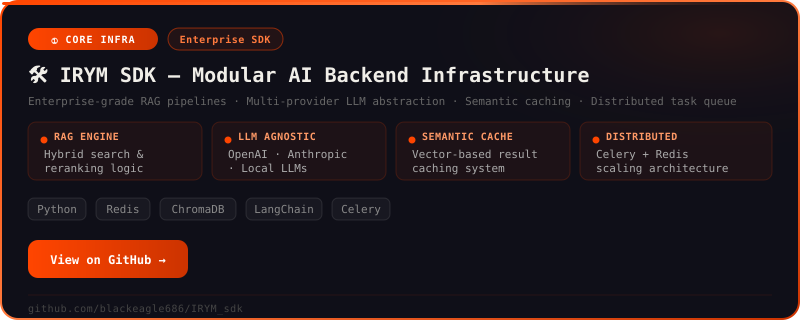
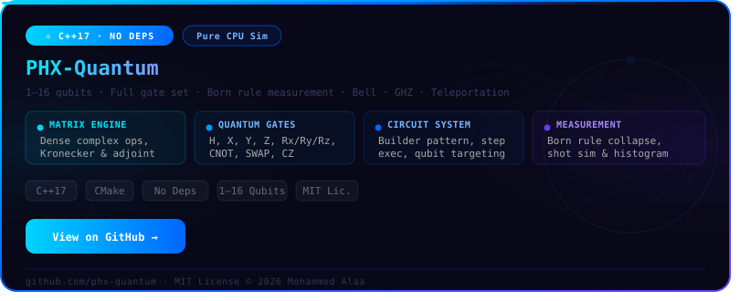
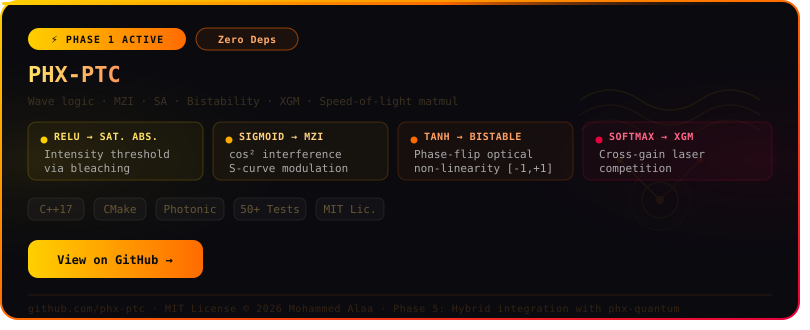
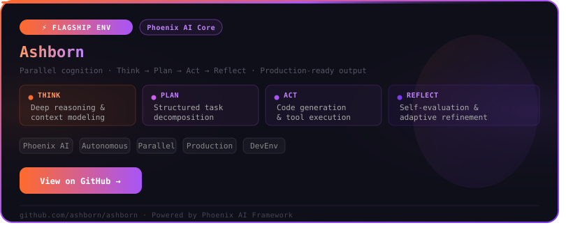
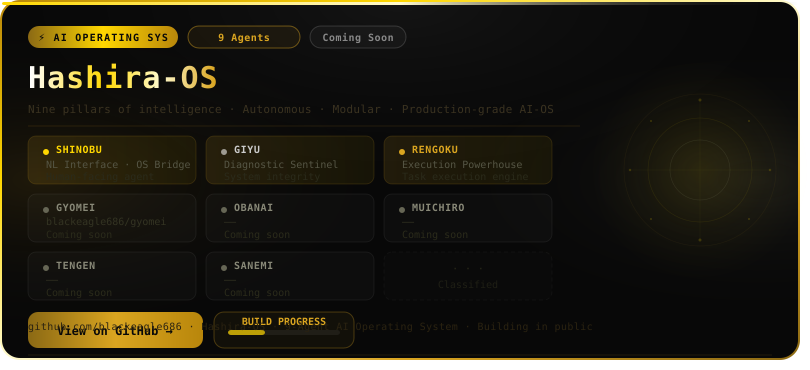
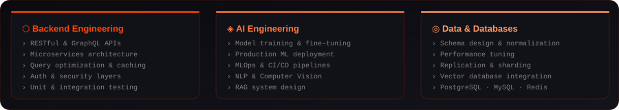

## 🐦‍🔥 Building My AI EMPIRE.

I specialize in designing scalable, modular AI infrastructure that transforms advanced research into production-ready systems capable of solving real-world problems efficiently, reliably, and at scale.

My work spans across agentic AI systems, retrieval architectures, distributed inference pipelines, and orchestration frameworks — all focused on building intelligent systems that are extensible, maintainable, and future-proof.

Beyond traditional AI engineering, I’m deeply exploring next-generation computing paradigms including quantum computing, photonic neural systems, and AI-native hardware acceleration, researching how computation itself can evolve beyond conventional silicon limitations.

I’m currently building my own AI framework — a unified ecosystem for agents, RAG pipelines, memory systems, model routing, orchestration, and multimodal intelligence — designed to adapt alongside emerging research, evolving models, and future hardware architectures.

I believe the future of AI belongs to engineers who can bridge infrastructure, intelligence, and computing at every layer of the stack.

---

 

 
 

## `01` — What I've Shipped

 

<!-- ① IRYM SDK -->

 

<!-- ② PHX-quantum -->

 

<!-- ② PHX-PTC -->

 

<!-- ② Ashborn-Agent -->

 

<!-- ① hashira os -->

 

---

## `02` — Expertise

---

## `03` — Stack

**━━━━━━━━━━━━━━━━ Languages ━━━━━━━━━━━━━━━━**

**━━━━━━━━━━━━━━━━ AI / ML ━━━━━━━━━━━━━━━━**

**━━━━━━━━━━━━━━━━ Backend & APIs ━━━━━━━━━━━━━━━━**

**━━━━━━━━━━━━━━━━ Databases & Vector DBs ━━━━━━━━━━━━━━━━**

**━━━━━━━━━━━━━━━━ DevOps & Tools ━━━━━━━━━━━━━━━━**

---

## `04` — GitHub Analytics

&nbsp;

  

  

---

## `05` — Let's Connect

*Open to collaborations, AI architecture discussions, and new opportunities*

 

&nbsp;

&nbsp;

&nbsp;

 

 

`I love autumn 🍁 and keeping things simple 🍂 — and if someone wants to leave, let them go .`

 

