<div align="center">

<!-- HERO BANNER — save hero-banner.svg in your repo root and link it here -->


<br/>

<!-- Animated typing under the hero -->


<br/><br/>

[](https://linkedin.com/in/mohammed-alaa-670867254)
[](mailto:mathematecs1@gmail.com)
[](https://github.com/blackeagle686)
[](https://mohammedalaa686.pythonanywhere.com/)

</div>

<br/>

---

## `01` &nbsp;—&nbsp; What I Build

<!-- EXPERTISE CARDS — save expertise-cards.svg in your repo root -->


<br/>

---

## `02` &nbsp;—&nbsp; Tech Stack

<div align="center">

**━━━━━━━━━━━━━━━━ Languages ━━━━━━━━━━━━━━━━**

[](https://python.org)
[](https://isocpp.org)
[](https://developer.mozilla.org/en-US/docs/Web/JavaScript)
[](https://www.mysql.com)

**━━━━━━━━━━━━━━━━ AI / ML ━━━━━━━━━━━━━━━━**

[](https://pytorch.org)
[](https://tensorflow.org)
[](https://keras.io)
[](https://scikit-learn.org)
[](https://opencv.org)
[](https://huggingface.co)
[](https://langchain.com)

**━━━━━━━━━━━━━━━━ Backend & APIs ━━━━━━━━━━━━━━━━**

[](https://fastapi.tiangolo.com)
[](https://djangoproject.com)
[](https://flask.palletsprojects.com)
[](https://graphql.org)
[](https://www.postman.com)

**━━━━━━━━━━━━━━━━ Databases & Vector DBs ━━━━━━━━━━━━━━━━**

[](https://postgresql.org)
[](https://mysql.com)
[](https://redis.io)
[](https://trychroma.com)
[](https://github.com/facebookresearch/faiss)
[](https://sqlite.org)

**━━━━━━━━━━━━━━━━ DevOps & Tools ━━━━━━━━━━━━━━━━**

[](https://docker.com)
[](https://kernel.org)
[](https://git-scm.com)
[](https://github.com/features/actions)

</div>

---
## `03` &nbsp;—&nbsp; Featured Projects

<div align="center">


&nbsp;


</div>

<br/>

---

### 🏆 &nbsp; Flagship Project

<div align="center">

<table width="90%">
<tr>
<td align="center" style="background:#0A0A0F; border-radius:12px; padding:24px;">


## 🤖 MyAgent v1.2 — Autonomous AI Agent

> **Hybrid Rust + Python framework with ReAct reasoning, self-reflection, and built-in AI tooling**

<br/>

| Capability | Detail |
|:---|:---|
| 🔄 **ReAct Loop** | Thought → Action → Observation cycle |
| ⚡ **Rust Core** | **12.8× faster** execution via PyO3 |
| 🧠 **Self-Reflection** | Persistent learning & memory system |
| 🧰 **Built-in Tools** | RAG · File System · REPL |
| �️ **Interface** | PySide6 GUI + CLI modes |

<br/>

[](https://python.org)
[](https://rust-lang.org)
[](https://pyo3.rs)
[](https://langchain.com)
[](https://trychroma.com)

<br/>

[](https://github.com/blackeagle686/MyAgent)

</td>
</tr>
</table>

</div>

<br/>

---

### � &nbsp; Core Infrastructure

<div align="center">

<table width="90%">
<tr>
<td align="center" style="background:#0A0A0F; border-radius:12px; padding:24px;">


## � IRYM SDK — Modular AI Backend Infrastructure

> **Production-ready, dependency-injected SDK for caching, RAG, queues, LLMs, and vector search**

<br/>

| Capability | Detail |
|:---|:---|
| � **DI Container** | Centralized dependency injection |
| 🎯 **Interface-First** | Clean, swappable architectural layers |
| ⚡ **Async-First** | Fully non-blocking design |
| 🔍 **Built-in RAG** | End-to-end retrieval pipeline |
| �️ **Multi-Store** | Redis · Qdrant · SQLAlchemy |

<br/>

[](https://fastapi.tiangolo.com)
[](https://redis.io)
[](https://qdrant.tech)
[](https://sqlalchemy.org)

<br/>

[](https://github.com/blackeagle686/IRYM_sdk)

</td>
</tr>
</table>

</div>

<br/>

---

### 🔬 &nbsp; AI Research System

<div align="center">

<table width="90%">
<tr>
<td align="center" style="background:#0A0A0F; border-radius:12px; padding:24px;">


## 🔬 HDA-v3 — Health Data Analysis Assistant

> **AI-powered histopathology diagnostic system for cancer detection & clinical reasoning**

<br/>

| Capability | Detail |
|:---|:---|
| 🎯 **Cancer Classification** | Fine-tuned EfficientNet-B0 — Colon · Lung · Squamous |
| 📝 **Clinical Reports** | Qwen2-VL vision-language reasoning |
| 💬 **AI Consultation** | Session-based medical assistant chat |
| � **Medical RAG** | ChromaDB + clinical guideline retrieval |
| � **Explainability** | Grad-CAM visual heatmaps |

<br/>

[](https://pytorch.org)
[](https://fastapi.tiangolo.com)
[](https://langchain.com)
[](https://trychroma.com)
[](https://huggingface.co)

<br/>

[](https://github.com/blackeagle686/hda_v3)

</td>
</tr>
</table>

</div>

<br/>

---

### 📊 &nbsp; Applied AI Products

<table>
<tr>

<td width="50%" valign="top">

<div align="center">


### 📊 SmartSheet — IRYM-1

*Natural Language Data Analysis Platform*

</div>

| Feature | Detail |
|:---|:---|
| 💬 **NL Interface** | Ask questions in plain English |
| 🐍 **Code Gen** | Auto-generated analysis scripts |
| 🔒 **Sandbox** | Secure isolated execution |
| 📈 **Visuals** | Charts & rich visualizations |

<br/>

[](https://djangoproject.com)
[](https://fastapi.tiangolo.com)
[](https://pandas.pydata.org)

<br/>

[](https://github.com/blackeagle686/SMART_SHEET_-IRYM-1-)

</td>

<td width="50%" valign="top">

<div align="center">


### 🖼️ IRYM 0 — Image Generation

*Text → Image AI Pipeline*

</div>

| Feature | Detail |
|:---|:---|
| 🎨 **Text-to-Image** | Diffusion model pipeline |
| ⚡ **Async Gen** | Non-blocking generation queue |
| 🤖 **LLM Orchestration** | Intelligent prompt refinement |
| 🗄️ **Persistent Store** | PostgreSQL asset management |

<br/>

[](https://fastapi.tiangolo.com)
[](https://huggingface.co)
[](https://postgresql.org)

<br/>

[](https://github.com/blackeagle686/IRYM_0.0)

</td>

</tr>
</table>

---

## 🧩 Skills Snapshot

```python
skills = {
  "Languages": ["Python", "Rust"],
  "Backend": ["Django", "FastAPI"],
  "AI": ["PyTorch", "RAG", "Agents", "Fine-tuning"],
  "Data": ["PostgreSQL", "ChromaDB", "Qdrant"],
  "Concepts": ["System Design", "MLOps"]
}

status = "Open to Work 🚀"
location = "Egypt 🇪🇬"
```

---

## `04` &nbsp;—&nbsp; GitHub Analytics

<div align="center">


&nbsp;


<br/><br/>


<br/><br/>


</div>

---

## `05` &nbsp;—&nbsp; Let's Connect

<div align="center">

*Open to collaborations, AI architecture discussions, and new opportunities*

<br/>

[](https://linkedin.com/in/mohammed-alaa-670867254)
&nbsp;
[](https://mohammedalaa686.pythonanywhere.com/)
&nbsp;
[](mailto:mathematecs1@gmail.com)
&nbsp;
[](https://github.com/blackeagle686)

<br/>


<br/>

`// "Code is like humor. When you have to explain it, it's bad." — Cory House`

</div>
